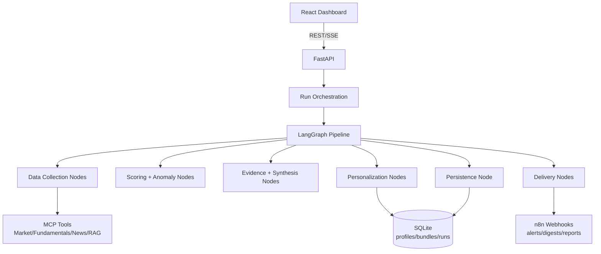

# Investora-AI

## Project Description
Investora-AI is an AI-powered investment decision-support platform that helps users turn fragmented market signals into clear weekly priorities. It combines market, fundamentals, and news data with AI reasoning to surface personalized opportunities, explain confidence levels, and support faster decision-making. The product focuses on clarity, trust, and consistency through transparent workflows, profile-aware recommendations, and measurable reliability gates.

## Executive Summary (Non-Technical)
Investora-AI addresses a common decision problem: too many market signals, too little clarity on what deserves attention now.  
It creates a single weekly decision workflow that helps users:
- prioritize opportunities based on relevance and conviction,
- align recommendations with their own risk profile and interests,
- stay informed through timely alerts and digest-style summaries.

The product is designed around trust and usability: clear progress visibility, consistent signal framing, and measurable reliability standards.

## Demo Links and Visuals
- Local app (frontend): `http://localhost:8080`
- Local API (backend, default): `http://localhost:8000`
- Streaming analysis endpoint: `POST /run-analysis-stream`
- Sample UI artifact: [`docs/examples/weekly-update-example.html`](./docs/examples/weekly-update-example.html)
- Architecture docs (PDF):
  - [`InvestoraAI — Full Architecture & Documentation.pdf`](./docs/architecture/InvestoraAI%20%E2%80%94%20Full%20Architecture%20%26%20Documentation.pdf)
  - [`InvestoraAI — Project Documentation.pdf`](./docs/architecture/InvestoraAI%20%E2%80%94%20Project%20Documentation.pdf)

## Architecture Diagram


## Main Features and Functionality
- Unified weekly analysis workflow:
  - Runs a structured end-to-end pipeline that collects market/fundamentals/news data and generates decision-ready outputs.
- Personalized recommendations:
  - Matches suggestions to user profile data (risk tolerance, interests, watchlist) and separates watchlist focus from discovery ideas.
- Prioritized opportunity scoring:
  - Ranks signals by relevance and conviction so users can focus on highest-impact decisions first.
- Transparent execution and progress tracking:
  - Exposes run stages and status updates to reduce black-box behavior and improve user trust.
- Streaming AI summaries and evidence synthesis:
  - Delivers incremental analysis output and supporting rationale through API streaming endpoints.
- Alerts and digest delivery:
  - Integrates with n8n webhooks to send timely notifications, summaries, and report handoffs.
- Data persistence and user dashboards:
  - Stores profiles, bundles, and run outputs in SQLite for dashboard retrieval and historical context.
- Reliability guardrails:
  - Includes contracts/tests and mock-mode execution paths to support safe iteration and stable behavior.

## Tech Stack
- Frontend:
  - React + TypeScript + Vite + React Query + Tailwind + shadcn/ui
- Backend:
  - FastAPI + LangGraph + Pydantic + SQLite
- AI/LLM and data providers:
  - OpenAI, Finnhub, Marketstack, FMP, optional Pinecone RAG
- Workflow integration:
  - n8n webhooks for alerts/digests/report handoff

## Setup (5–8 Commands)
```bash
# 1) Go to project
cd investora-ai

# 2) Install frontend deps
npm install

# 3) Create frontend env
cp .env.example .env.local

# 4) Create backend env
cp langgraph/.env.example langgraph/.env

# 5) Install backend deps
python -m pip install -r langgraph/requirements.txt

# 6) Run backend API
cd langgraph && python -m uvicorn app.api:app --reload --port 8000

# 7) Run frontend (new terminal)
cd .. && npm run dev
```

## Environment Variables
### Frontend (`investora-ai/.env.local`)
| Variable | Required | Purpose |
|---|---|---|
| `VITE_API_BASE_URL` | Yes | Backend API base URL |
| `VITE_N8N_BASE_URL` | Optional | n8n UI/API integration base |
| `VITE_SENTRY_DSN` | Optional | Frontend error tracking |

### Backend (`investora-ai/langgraph/.env`)
| Variable | Required | Purpose |
|---|---|---|
| `USE_MOCK_DATA` | Yes | Use deterministic mock providers (`true/false`) |
| `OPENAI_API_KEY` | Required for live synthesis/planning | LLM provider key |
| `OPENAI_MODEL` | Optional | Planner model (default in settings) |
| `SYNTHESIS_MODEL` | Optional | Evidence synthesis model |
| `NEWS_API_KEY` | Required for live data | Finnhub news key |
| `FUNDAMENTALS_API_KEY` | Required for live data | FinancialModelingPrep key |
| `MARKET_DATA_API_KEY` | Required for live data | Marketstack key |
| `PINECONE_HOST` / `PINECONE_API_KEY` | Optional | RAG retrieval backend |
| `CORS_ORIGINS` | Optional | Allowed frontend origins |
| `CRON_SECRET` | Optional | Protect run endpoints |
| `RUN_QUEUE_WAIT_SECONDS` | Optional | Queue wait behavior |
| `GRAPH_RECURSION_LIMIT` | Optional | LangGraph execution limit |
| `SENTRY_DSN` | Optional | Backend error tracking |

## Testing and Quality Gates
```bash
# Backend tests
cd langgraph && python -m pytest -q tests

# Frontend tests
cd .. && npm run test

# Frontend production build
npm run build
```

Contract/integration coverage includes:
- `/run-analysis-stream`
- `/user/{id}/dashboard`
- `/user/{id}/personalized-signals`
- mock fast-path LangGraph integration

## Known Limitations
- AI summary quality varies with external provider availability and latency.
- Large frontend chunks indicate room for code splitting and performance tuning.
- Full market-grade compliance controls are not yet implemented (advisory/disclaimer hardening can be expanded).

## Roadmap (Strategic Priorities)
### Next 30 Days: Adoption and Decision Quality
- Increase first-week user activation through onboarding clarity and faster “time to first useful insight.”
- Define and track product KPIs for decision quality (relevance, confidence, and follow-through signals).
- Tighten recommendation framing so users can compare opportunities with less cognitive effort.

### Next 60 Days: Product-Market Fit Signals
- Strengthen personalization depth using behavior feedback loops (what users keep, dismiss, or act on).
- Improve alert usefulness with better prioritization and cadence controls.
- Validate retention hypotheses by cohort (new users vs. repeat weekly users).

### Next 90 Days: Scale and Commercial Readiness
- Expand from single-user workflows toward advisor/team use cases.
- Introduce portfolio-level narratives and scenario views for higher-value decision contexts.
- Prepare a production-readiness package focused on reliability, governance, and stakeholder reporting.

## Consulting Lens: Tradeoffs, Decisions, Risks
### Key tradeoffs
- Chose phased refactor (behavior-preserving) over rewrite to protect delivery continuity.
- Kept SQLite for speed and portability; accepted scaling limits for MVP stage.
- Used deterministic mock mode to accelerate testing and reduce provider-cost risk.

### Delivery decisions
- Modularized LangGraph nodes by responsibility to reduce change coupling.
- Added service/repository boundaries for reusable business logic across API/cron paths.
- Added contract tests before deeper changes to prevent user-facing regressions.

### Risks to monitor
- Provider outage/rate-limit concentration for live runs.
- Drift between product UX expectations and backend signal semantics.
- Overfitting personalization without explicit user feedback loop metrics.

## Project Narrative
Read the one-page framing here:
- [`docs/WHY_THIS_PROJECT_MATTERS.md`](./docs/WHY_THIS_PROJECT_MATTERS.md)
