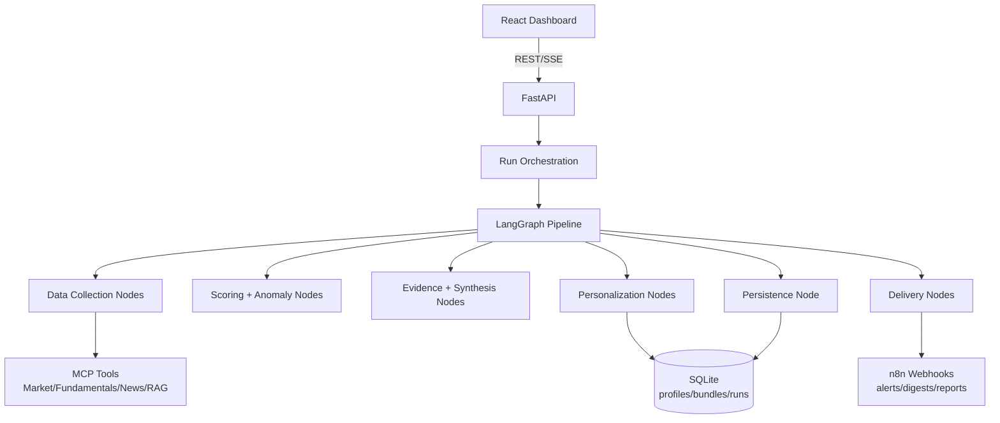

# Investora-AI

AI-powered investment intelligence platform combining a LangGraph analysis pipeline with a React dashboard for personalized signals, alerts, and weekly digests.

## Executive Summary (Non-Technical)
Investora-AI helps users move from market noise to focused weekly decisions. Instead of manually combining headlines, price moves, and fundamentals, users get:
- a curated set of high-priority opportunities,
- profile-aware watchlist and discovery signals,
- actionable alerts and digest delivery.

The product is built for trust and iteration: transparent run progress, evidence-aware outputs, and regression-tested APIs.

## Demo Links and Visuals
- Local app (frontend): `http://localhost:8080`
- Local API (backend, default): `http://localhost:8000`
- Streaming analysis endpoint: `POST /run-analysis-stream`
- Sample UI artifact: [`docs/examples/weekly-update-example.html`](./docs/examples/weekly-update-example.html)
- Architecture docs (PDF):
  - [`InvestoraAI — Full Architecture & Documentation.pdf`](./docs/architecture/InvestoraAI%20%E2%80%94%20Full%20Architecture%20%26%20Documentation.pdf)
  - [`InvestoraAI — Project Documentation.pdf`](./docs/architecture/InvestoraAI%20%E2%80%94%20Project%20Documentation.pdf)

## Architecture Diagram


## Key Features and User Value
- Personalized signals:
  - Watchlist + discovery buckets aligned with profile and risk preferences.
- ReAct-style analysis pipeline:
  - Deterministic in mock mode; provider-backed in live mode.
- Real-time run visibility:
  - SSE node-progress stream improves transparency and trust.
- Alerting and weekly digests:
  - User-level urgency filtering and notification delivery.
- Reliability controls:
  - Contract tests, integration tests, typed config, and logging redaction.

## Tech Stack
- Frontend:
  - React + TypeScript + Vite + React Query + Tailwind + shadcn/ui
- Backend:
  - FastAPI + LangGraph + Pydantic + SQLite
- AI/LLM and data providers:
  - OpenAI, Finnhub, Marketstack, FMP, optional Pinecone RAG
- Workflow integration:
  - n8n webhooks for alerts/digests/report handoff

## Setup (5–8 Commands)
```bash
# 1) Go to project
cd investora-ai

# 2) Install frontend deps
npm install

# 3) Create frontend env
cp .env.example .env.local

# 4) Create backend env
cp langgraph/.env.example langgraph/.env

# 5) Install backend deps
python -m pip install -r langgraph/requirements.txt

# 6) Run backend API
cd langgraph && python -m uvicorn app.api:app --reload --port 8000

# 7) Run frontend (new terminal)
cd .. && npm run dev
```

## Environment Variables
### Frontend (`investora-ai/.env.local`)
| Variable | Required | Purpose |
|---|---|---|
| `VITE_API_BASE_URL` | Yes | Backend API base URL |
| `VITE_N8N_BASE_URL` | Optional | n8n UI/API integration base |
| `VITE_SENTRY_DSN` | Optional | Frontend error tracking |

### Backend (`investora-ai/langgraph/.env`)
| Variable | Required | Purpose |
|---|---|---|
| `USE_MOCK_DATA` | Yes | Use deterministic mock providers (`true/false`) |
| `OPENAI_API_KEY` | Required for live synthesis/planning | LLM provider key |
| `OPENAI_MODEL` | Optional | Planner model (default in settings) |
| `SYNTHESIS_MODEL` | Optional | Evidence synthesis model |
| `NEWS_API_KEY` | Required for live data | Finnhub news key |
| `FUNDAMENTALS_API_KEY` | Required for live data | FinancialModelingPrep key |
| `MARKET_DATA_API_KEY` | Required for live data | Marketstack key |
| `PINECONE_HOST` / `PINECONE_API_KEY` | Optional | RAG retrieval backend |
| `CORS_ORIGINS` | Optional | Allowed frontend origins |
| `CRON_SECRET` | Optional | Protect run endpoints |
| `RUN_QUEUE_WAIT_SECONDS` | Optional | Queue wait behavior |
| `GRAPH_RECURSION_LIMIT` | Optional | LangGraph execution limit |
| `SENTRY_DSN` | Optional | Backend error tracking |

## Testing and Quality Gates
```bash
# Backend tests
cd langgraph && python -m pytest -q tests

# Frontend tests
cd .. && npm run test

# Frontend production build
npm run build
```

Contract/integration coverage includes:
- `/run-analysis-stream`
- `/user/{id}/dashboard`
- `/user/{id}/personalized-signals`
- mock fast-path LangGraph integration

## Known Limitations
- AI summary quality varies with external provider availability and latency.
- Large frontend chunks indicate room for code splitting and performance tuning.
- Full market-grade compliance controls are not yet implemented (advisory/disclaimer hardening can be expanded).

## Roadmap (Next)
- Add stronger end-to-end KPI instrumentation (time-to-insight, alert precision proxy metrics).
- Expand integration tests across weekly digest and alert webhook flows.
- Introduce deeper portfolio analytics and scenario/risk simulations.
- Improve frontend performance with route-level chunking and lazy data loading.

## Consulting Lens: Tradeoffs, Decisions, Risks
### Key tradeoffs
- Chose phased refactor (behavior-preserving) over rewrite to protect delivery continuity.
- Kept SQLite for speed and portability; accepted scaling limits for MVP stage.
- Used deterministic mock mode to accelerate testing and reduce provider-cost risk.

### Delivery decisions
- Modularized LangGraph nodes by responsibility to reduce change coupling.
- Added service/repository boundaries for reusable business logic across API/cron paths.
- Added contract tests before deeper changes to prevent API regressions.

### Risks to monitor
- Provider outage/rate-limit concentration for live runs.
- Drift between product UX expectations and backend signal semantics.
- Overfitting personalization without explicit user feedback loop metrics.

## Project Narrative
Read the one-page framing here:
- [`docs/WHY_THIS_PROJECT_MATTERS.md`](./docs/WHY_THIS_PROJECT_MATTERS.md)
