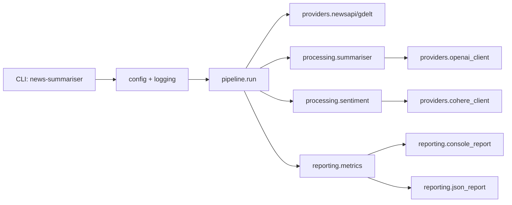

# Architecture

## Key design choices

- Provider wrappers isolate upstream SDK and HTTP concerns.
- Processing modules remain pure and testable.
- Pipeline orchestrates control flow, failure isolation, and metrics.
- Reporting layer formats outputs without business logic.
