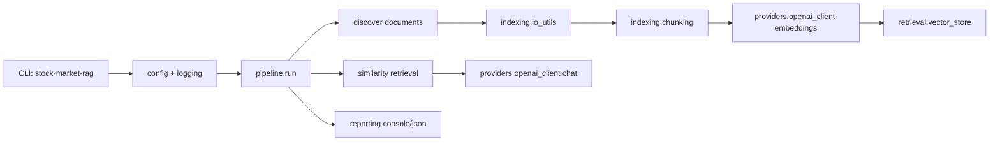

# Architecture

## Design rationale

- Clear module boundaries simplify testing and future provider swaps.
- Typed exceptions map external failures into user-actionable messages.
- Structured logging provides run-level traceability for debugging and demos.
